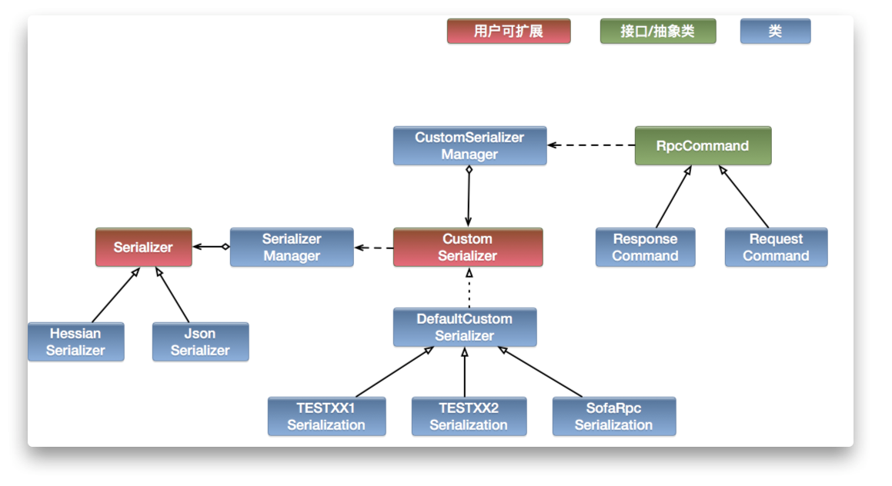
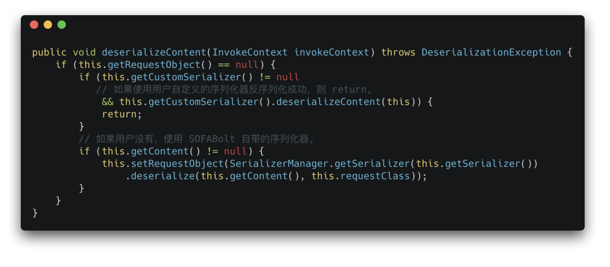
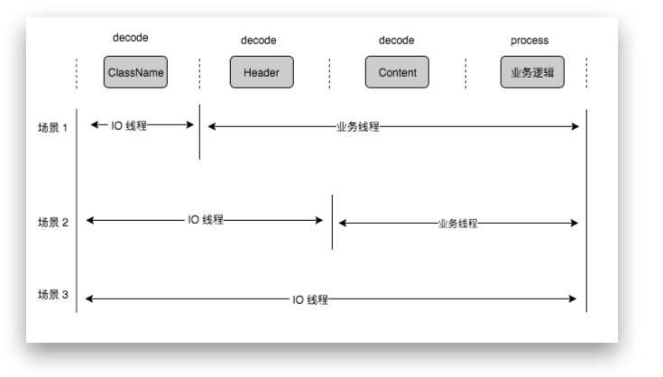
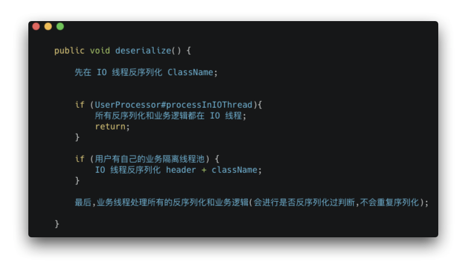
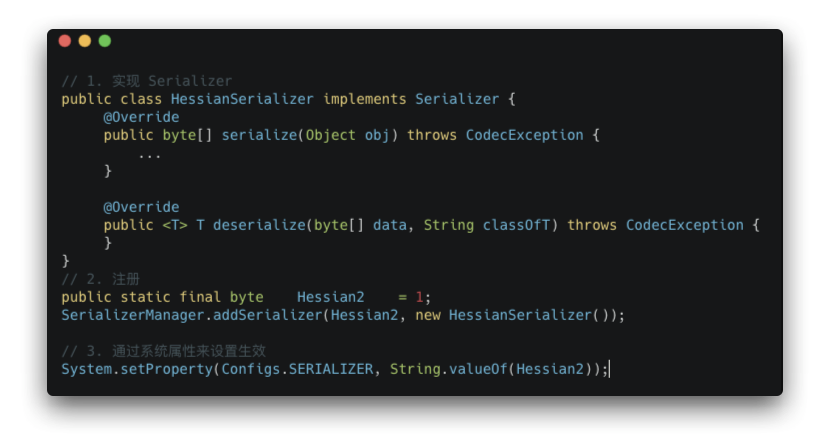
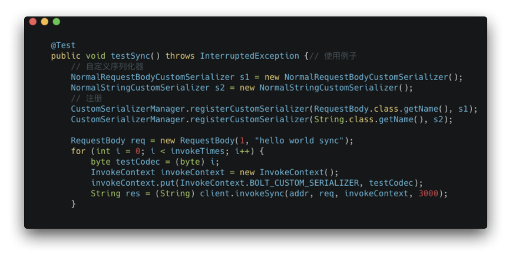

## 前言

SOFABolt 是一款基于 Netty 最佳实践，通用、高效、稳定的通信框架。目前已经运用在了蚂蚁中间件的微服务，消息中心，分布式事务，分布式开关，配置中心等众多产品上。

本文将重点分析 SOFABolt 的序列化机制。

我们知道，但凡在网络中传输数据，都涉及到序列化以及反序列化。即将数据编码成字节，再把字节解码成数据的过程。

例如在 RPC 框架中，一个重要的性能优化点是序列化机制的设计。即如何为服务消费者和和服务提供者提供灵活的，高性能的序列化器。

这里说的序列化器，不仅仅是指“对象”的序列化器，例如 Hessian，Protostuff，JDK 原生这种“对象”级别的序列化器，而是指“协议”级别的序列化器，“对象”的序列化只是其中一部分。通常“协议”级别的序列化器包含更多的信息。

下面我们将先从 SOFABolt 的设计及实现入手，进而分析 SOFABolt 详细的序列化与分序列化流程，最后介绍 SOFABolt 序列化扩展。

## 设计及实现

一个优秀的网络通信框架，必然要有一个灵活的，高性能的序列化机制。那么，SOFABolt 序列化机制的设计目标是什么呢？具体又是如何设计的呢？

首先说灵活，灵活指的是，框架的使用方（这里指的是网络通信框架的使用方，例如 RPC，消息中心等中间件）能够自定义自己的实现，即用户决定使用什么类型的序列化以及怎么序列化。

再说高效，序列化和反序列化事实上是一个重量级的操作，阿里 HSF 作者毕玄在著名的 [NFS-RPC框架优化过程（从37k到168k）](http://bluedavy.me/?p=384) 文章中提到，其优化 RPC 传输性能的第一步就是调整反序列化操作，从而将 TPS 从 37k 提升到 56k。之后又通过更换对象序列化器，又将 TPS 提升了将近 10k。由此可见，合理地设计序列化机制对性能的影响十分巨大。

而 SOFABolt 和 HSF 有着亲密的血缘关系，不但有着 HSF 的高性能，甚至在某些地方，优化的更为彻底。

我们现在可以看看 SOFABolt 序列化设计。

### 接口设计

SOFABolt 设计了两个接口：

1. Serializer 该接口定义 serialize 方法和 deserialize 方法，用于对象的序列化和反序列化。
2. CustomSerializer   该接口定义了很多方法，主要针对自定义协议中的 header 和 content 进行序列化和反序列化。同时提供上下文，以精细的控制时机。

同时，从框架设计的角度说，他们可以称之为 “核心域”， 他们也被对应的 “服务域” 进行管理。

这里解释一下服务域和核心域，在框架设计里，通常会有“核心域”，“服务域”， “会话域” 这三部分组成。

例如在 Spring 中，Bean 就是核心域，是核心领域模型，所有其他模型都向其靠拢；而 BeanFactory 是服务域，即服务“核心域”的模型，通常长期存在于系统中，且是单例；“会话域” 指的是一次会话产生的对象，会话结束则对象销毁，例如 Request，Response。

在 SOFABolt 序列化机制中，Serializer 和 CustomSerializer 可以认为是核心域，同时，也有服务于他们的 “服务域”，即 SerializerManager 和 CustomSerializerManager。“会话域” RpcCommand 依赖 “服务域” 获取 “核心域” 实例。

UML 设计图如下：

其中红色部分就是 SOFABolt 序列化机制的核心接口，同时也是用户的扩展接口，他们被各自的 Manager 服务域进行管理，最后，会话域 RpcCommand 依赖着 Manager 以获取序列化组件。

这两个接口的使用场景通常在数据被 `协议编解码器` 编码之前或解码之后，进行处理。

例如在发送数据之前，`协议编码器` 根据通信协议（如 bolt 协议）进行编码，编码之前，用户需要将数据的具体内容进行序列化，`协议编解码器` 再进行更详细的编码。

同样，`协议解码器` 在接收到 Socket 发送来的字节后，根据协议将字节解码成对象，但是，对象的内容还是字节，需要用户进行反序列化。

一个比较简单的流程图就是这样的:

上图中，假设场景是 Client 发送数据给 Server，那么，编解码器负责将字节流解码成 Command 对象，序列化器负责将 Command 对象里的内容反序列化成业务对象，从设计模式的角度看，这里是 GOF 中 “命令模式”和“职责链模式”的组合设计。

看完了设计，再看看实现。

### 接口实现

我们可以看看这两个接口的实现。

- **Serializer**

Serializer 接口在 SOFABolt 中已有默认实现，即 HessianSerializer，目前使用的是 hessian-3.3.0 版本。通过一个 SerializerManager 管理器进行管理。注意，这个管理器内部使用的是数组，而不是 Map，这在上文毕玄的文章也曾提到：通过使用数组替换成 Map，NFS-RPC 框架的 TPS 从 153k 提升到 160k。事实上，任何对性能非常敏感的框架，**能用数组就绝不用 Map**，例如 Netty 的 FastThreadLocal，也是如此。

当然，Serializer 接口用户也是可以扩展的，例如使用 protostuff，FastJson，kryo 等，扩展后，通过 SerializerManager 可以将自己的序列化器添加到 SOFABolt 中。注意：这里的序列化 type 实际就是上面提到的数组的下标，所以不能和其他序列化器的下标有冲突。

- **CustomSerializer**

再说 CustomSerializer，这个接口也是有默认实现的，用户也可以选择自己实现，我们这里以 SOFARPC 为例。

SOFARPC 在其扩展模块 `sofa-rpc-remoting-bolt` 中，通过实现 CustomSerializer 接口，自己实现了序列化 header，content。

这里稍微扩展讲一下 header 和 content。实际上，header 和 content 类似 http 协议的消息头和消息体，header 和 content 中到底存放什么内容，取决于协议设计者。

例如在 SOFARPC 的协议中，header 里存放的是一些扩展属性和元信息上下文。而 content 中存放的则是主要的一些信息，比如 request 对象，request 对象里就存放了 RPC 调用中常用信息了，例如参数，类型，方法名称。

同时，CustomSerializer 接口定义的方法中，提供了 InvokeContext 上下文，例如`是否泛化调用`等信息，当进行序列化时，将是否泛型的信息放入上下文，反序列化时，再从上下文中取出该属性，即可正确处理泛化调用。

**注意，如果用户已经自己实现了 CustomSerializer 接口，那么 SOFABolt 的 SerializerManager 中设置的序列化器将不起作用！因为 SOFABolt 优先使用用户的序列化器。**

具体代码如下：

行文至此，讨论的都是“灵活”这个设计，即用户既可以使用 SOFABolt 默认的序列化器，也可以使用自定义序列化器做更多的定制，值得注意的是： SOFABolt 优先使用用户的序列化器。

让我们再谈谈序列化的高性能部分 。

## 性能优化

上文提到，序列化和反序列化是重量级操作。通常，对性能敏感的框架都会对这一块进行性能优化。

一般对序列化操作进行性能优化有以下三个实践：

1. 减少字段，即使用更加复杂的映射从而减少网络中字段的传输和编解码。
2. 使用零拷贝的序列化器，例如利用 Protostuff 实现序列化零拷贝。通常的反序列化都是 ByteBuf–>byte[]–>Biz 转换过程，我们可以将中间的 byte[] 转换过程砍掉，实现序列化的零拷贝。
3. 将字段拆分在不同的线程里进行反序列化。

限于篇幅，本文将重点介绍第三点。

我们以 SOFARPC 协议为例，序列化内容包括 4 个部分：

1. 基本字段（固定24字节）
2. ClassName(变长字节)
3. Header（变长字节）
4. Content（变长字节）

可以看到，基本字段数据很少，序列化的主要压力在后 3 个部分。

注意： 在请求发送阶段，即调用 Netty 的 writeAndFlush 接口之前，会在业务线程做好序列化，这部分没什么压力。

但是，反序列化就不同了。

我们知道，高性能的网络框架基本都是使用的 Reactor 模型，即一个线程挂载多个 Channel（Socket），这个线程一般称之为 IO 线程，如果这个线程执行任务耗时过长，将影响该线程下所有 Channel 的响应时间。无论是 Netty 的主要 Commiter —— Norman 还是 HSF 作者毕玄，都曾提出：永远不要在 IO 线程做过多的耗时任务或者阻塞 IO 线程。

因此，为了性能考虑，这 3 个字段通常不会都在 IO 线程中进行反序列化。

在 SOFABolt 默认的 RPC 协议实现中，**默认 IO 线程只反序列化 ClassName**，剩下的内容由业务线程反序列化。同时，为了最大程度配合业务特性，保证整体吞吐量， SOFABolt 设计了精细的开关来控制反序列化时机:

|       | 使用场景                        | IO线程池策略                                                 | 业务线程池策略                          |
| ----- | ------------------------------- | ------------------------------------------------------------ | --------------------------------------- |
| 场景1 | 业务逻辑执行耗时（默认）        | 只反序列化className                                          | 反序列化header和content，并执行业务逻辑 |
| 场景2 | 隔离业务线程池                  | 反序列化className和header，并根据header选择业务线程池        | 反序列化content并执行业务逻辑           |
| 场景3 | 不切换线程，应用于TPS较低的场景 | IO线程完成所有的操作，反序列化className、header、content、执行业务逻辑 | 无业务线程池                            |

反序列化时机的选择关系到系统的性能，同时在选择这个策略时也要结合具体的业务场景。比如使用场景1的方式，可以在业务线程池中再加一个根据Header的分发逻辑，使IO线程做尽量少的工作， 同时不同的业务操作之间也能通过线程池隔离，达到场景2的目的，

但是相对场景2的方式多了一次线程切换的开销。比如业务场景非常简单且预期的TPS也很低，那么选择场景3的方式来减少编程的复杂度 可能是更好的方式。反序列化时机的选择需要贴合自己的实际业务场景去考量。

其中，SOFABolt 提供了一个接口，用于定义是否在 IO 线程执行所有任务：

- UserProcessor#processInIOThread

1. 如果用户返回 true，表示，所有的序列化及业务逻辑都在 IO 线程中执行。
2. 反之，如果返回 fasle 且用户使用了线程池隔离策略，那么就由 IO 线程反序列化 header + className。
3. 最后，如果返回 false，但用户没有使用线程池隔离策略，那么所有的反序列化和业务逻辑则都在默认（Server默认或者业务默认）线程池执行。

伪代码如下：

## 流程分析

为了直观的描述 SOFABolt 序列化与反序列化流程， 我们将会给出对象处理的时序图。实际上，应该有 4 种序列图：

1. Request 对象的序列化
2. Request 对象的反序列化
3. Response 对象的序列化
4. Response 对象的反序列化

但限于篇幅，本文只给出 2 和 3 的序列图，只当抛砖引玉，有兴趣的同学可以自己查看源码：）

首先是客户端序列化 Response 对象。

然后是服务端反序列化 Request 对象，实际上，性能优化通常就是在这个调用序列中 :）

注意，上图 “处理器根据用户设置进行精细反序列化” 步骤，就是 SOFABolt 对序列化优化的核心步骤。

## 扩展设计

为了方便用户自定义序列化需求，SOFABolt 提供了两种扩展方式设计：

### 1. 简单的对象序列化扩展，例如 hessian，json，protostuff

如上文所述，如果没有自定义 header 和 content 的需求，那么直接使用 SOFABolt 的默认序列化即可，你可以通过以下方式来更换不同的序列化器（默认 hessian）：

### 2. 扩展 CustomSerializer 接口，自定义序列化 header，content

如果你需要自定义序列化，那么你可以参考 SOFARPC 的方式，自己实现 CustomSerializer 接口，然后将其注册到 SOFABolt 中，示例代码：

同时，SOFABolt 源码中有更详细的示例代码，地址：[使用示例](https://github.com/sofastack/sofa-bolt/blob/master/src/test/java/com/alipay/remoting/rpc/serializer/CustomSerializerCodecTest.java#L133)

## 总结

上文阐述了 SOFABolt 序列化的设计与实现，以及 SOFABolt 的序列化详细机制，这里再做一下总结：

1. **灵活的控制反序列化时机的重要性**   由于服务提供者需要提供**高性能**的服务，通常使用 Reactor 模型的架构，那么，就需要注意：通常不能在 IO 线程做耗时操作。因此，SOFABolt 默认只在 IO 线程反序列化少量数据（ClassName），其余的数据都由业务线程进行反序列化，以最大化的利用 IO 线程处理连接的能力。    同时，SOFABolt 也提供了更多场景的下的反序列化时机，例如 IO 密集型的业务，为了防止大量上下文切换，就可以直接在 IO 线程处理所有任务，包括业务逻辑。同时也停供业务线程池隔离的场景，此时 IO 线程在反序列化 ClassName 的基础上，再反序列化 header，剩下的交有业务线程池。不可谓不灵活。
2. **可扩展机制的重要性**   一个好的设计的框架，通常遵守 “微核插件式，平等对待第三方规则，如果做不到微核，至少要平等对待第三方， 原作者要把自己当作扩展者，这样才能保证框架的可持续性及由内向外的稳定性”。 SOFABolt 的序列化器，用户可以自定义扩展，无论是简单的修改对象序列化器，还是自定义整个 header 和 content 的序列化，都是非常简单的。让用户可以方便的扩展。因此，无论你是 RPC 中间件，还是消息队列中间件，使用 SOFABolt 来进行序列化都是非常的方便。