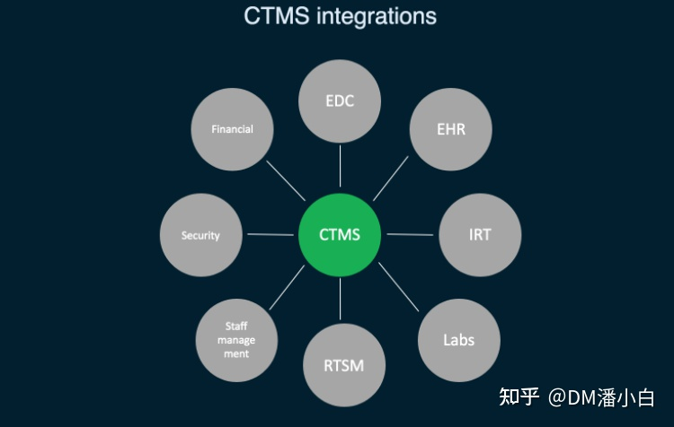
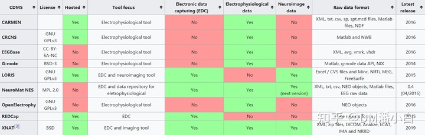

1、EDC系统（Electronic Data Capture）临床试验电子数据采集系统简单来说，EDC系统是一种收集临床试验中的患者数据的系统。通常，数据通常先记录在纸上，然后再转录到系统中，并保存在电子病历报告表（eCRF）中。 但现在越来越多的临床试验正在转向EDC系统，并用电子记录代替纸质记录。 EDC取代了传统的使用纸张收集数据的方法，缩短并加快了数据收集、药品和医疗设备的上市时间。 EDC系统已被制药公司和合同研究组织（CRO）广泛采用。

2、CTMS（Clinical Trial Management System）临床试验信息管理系统CTMS是一个项目管理工具，可以有效规划，管理和跟踪临床研究项目。它由不同工具组成，CTMS可以选择中心和监查，患者招募，联系人管理，财务管理和监管文件。CTMS着重于研究项目本身的管理，并不专注于数据收集。CTMS和EDC是互补的关系，大多数临床研究都使用这两种系统。EDC侧重于收集患者数据，CTMS侧重于临床试验的项目管理方面。系统之间可以直连，能将一部分EDC数据集成到CTMS中。

3、CDMS（Clinical Data Management System）临床数据管理系统CDMS是临床研究中用于管理临床试验数据的工具。研究人员现场收集的临床试验数据存储在CDMS中，CDMS可以是独立的，也可以是CTMS功能的一部分。

From WikipediaEDC是专注于收集eCRF中的临床数据，其他系统比如上图中的XNAT，可以收集不适合eCRF的数据模式，如电生理学和神经影像等数据。比如RAVE可以连接到IVRS（交互式语音应答系统）设施，以通过对患者进行直接电话采访来捕获数据。所以，EDC系统属于CDMS，但现在EDC也可以是临床数据管理系统（CDMS)的另一个缩写，EDC可以是CDMS，并且术语可以互换使用。