> You should not be a if-else coder, should be a complexity conquer. -Frank

这篇文章，是对之前我在[《一文教会你如何写复杂业务代码》](https://blog.csdn.net/significantfrank/article/details/101095244)说的“自上而下的结构化分解 + 自下而上的抽象建模”方法论的升级。因为在之前的方法论中，我们缺少一个多维度看问题的视角，这种维度思维的缺失，可能会导致miss掉一些重要的业务信息，从而使我们制定软件设计策略的时候，陷入困难。

有了维度思维，我们便可以更加方面的去看清业务的全貌，更加全面的掌握业务信息，从而帮助我们更加体系化的去治理复杂性。

# 从if-else说起

我经常说，**我们不要做一个if-else coder**。这里的if-else，不是说我们在coding的时候不能使用if-else，而是说我们不应该简陋的用if-else去实现业务的分支流程，因为这样随意的代码堆砌很容易堆出一座座“屎山”。

**业务的差异性是if-else的根源**。以零售通的商品业务为例。不同的处理场景，其业务逻辑实现是有差异性的。如下图所示，商品业务的差异性，主要体现在商品类型、销售方式和仓储方式的不同。
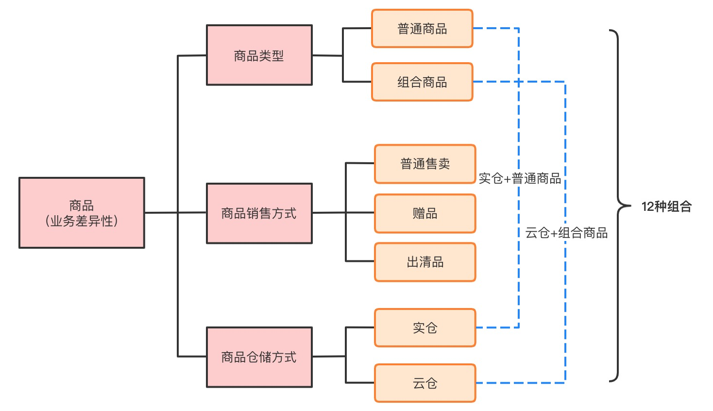

这三个维度上的差异组合起来，有2 * 3 * 2 = 12之多。这就是为什么在老代码中，到处可以看到`if(组合品) blabla`，`if(赠品) blabla`，`if(实仓) blabla`之类的代码。

那么，要如何消除这些讨厌的if-else呢？我们可以考虑以下两种方式：

- 多态扩展：利用面向对象的多态特性，实现代码的复用和扩展。
- 代码分离：对不同的场景，使用不同的流程代码实现。这样很清晰，但是可维护性不好。

## 多态扩展

多态扩展可以有继承和组合两种方式。继承勿用多言，组合有点像策略模式，也就是把需要扩展的部分封装、抽象成需要被组合的对象，然后对其进行扩展，比如星环的能力扩展点就是这种方式。

这里，我们举一个继承的例子，商品在上架的时候要检查商品的状态是否可售，普通商品（Item）检查自己就好了，而组合商品（CombineItem）需要检查每一个子商品。

用过程式编码的方式，很容易就能写出如下的代码：

```java
    public void checkSellable(Item item){
        if (item.isNormal()){
            item.isSellable(); 
            //省略异常处理
        }
        else{
            List<Item> childItems = getChildItems();
            childItems.forEach(childItem -> childItem.isSellable()); 
            //省略异常处理
        }

    }
```

然而，这个实现不优雅，不满足OCP，也缺少业务语义显性化的表达。更好的做法是，我们可以把CombineItem和Item的关系通过模型显性化的表达出来。

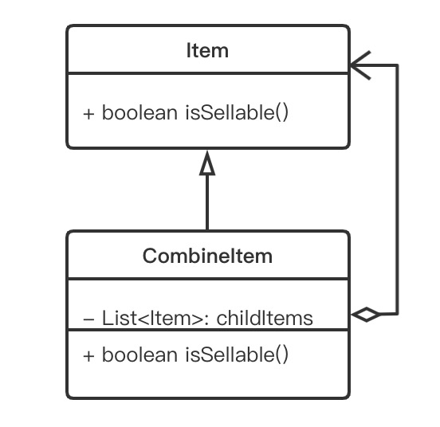

这样一来，一方面模型正确的反应了实体关系，更清晰了。另一方面，我们可以利用多态来处理CombineItem和Item的差异，扩展性更好。重构后，代码会变成：

```java
    public void checkSellable(Item item){
        if (!item.isSellable()){
            throw new BizException("商品的状态不可售，不能上架");
        }
    }
```

## 代码分离

所谓的代码分离是指，对于不同的业务场景，我们用不同的编排代码将他们分开。以商品上架为例，我们可以这样写：

```java
    /**
     * 1. 普通商品上架
     */
    public void itemOnSale(){
        checkItemStock();//检查库存
        checkItemSellable();//检查可售状态
        checkItemPurchaseLimit();//检查限购
        checkItemFreight();//检查运费
        checkItemCommission();//检查佣金
        checkItemActivityConflict();//检查活动冲突

        generateCspuGroupNo();//生成单品组号
        publishItem();//发布商品
    }

    /**
     * 2. 组合商品上架
     */
    public void combineItemOnSale(){
        checkCombineItemStock();//检查库存
        checkCombineItemSellable();//检查可售状态
        checkCombineItemPurchaseLimit();//检查限购
        checkCombineItemFreight();//检查运费
        checkCombineItemCommission();//检查佣金
        checkCombineItemActivityConflict();//检查活动冲突

        generateCspuGroupNo();//生成单品组号
        publishCombineItem();//发布商品
    }
    
    /**
     * 3. 赠品上架
     */
    public void giftItemOnSale(){
        checkGiftItemSellable();//检查可售状态
        publishGiftItem();//发布商品
    }
```

这种方式，当然也可以消除if-else，彼此独立，也还清晰。但复用性是个问题。

## 多维分析

细心的你可能已经发现了，在上面的案例中，普通商品和组合商品的业务流程基本是一样的。如果采用两套编排代码，有点冗余，这种重复将不利于后期代码的维护，会出现散弹式修改（一个业务逻辑要修改多处）的问题。

一个极端情况是，假如普通商品和组合商品，只有`checkSellable()`不一样，其它都一样。那毫无疑问，我们使用有多态（继承关系）的CombineItem和Item来处理差异，会更加合适。

而赠品上架的情况恰恰相反，它和其他商品的上架流程差异很大。反而不适合和他们合用一套流程代码，因为这样反而会增加他人的理解成本。还不如单独起一个流程来的清晰。

那么，问题来了，我们什么时候要用多态来处理差异，什么时候要用代码分离来处理差异呢？

**接下来，是我今天要给你着重介绍的多维度分析问题的方法论之一：矩阵分析法**。

我们可以弄一个矩阵，纵列代表业务场景，横列代表业务动作，里面的内容代表在这个业务场景下的业务动作的详细业务流程。对于我们的商品业务，我们可以得到如下的矩阵：

|               | 创建商品                                                     | 上架商品                                                     | 上架审核通过                                                 | 上架审核拒绝 |
| ------------- | ------------------------------------------------------------ | ------------------------------------------------------------ | ------------------------------------------------------------ | ------------ |
| 普通品 + 实仓 | 1. 检查cspu状态。 2. 检查cspu图片质量。 3. 检查上架资质。 4. 检查商品唯一性。 5. 检查品牌唯一性。 6. 检查价格信息。 7. 创建商品。 | 1. 检查库存。 2. 检查可售状态。 3. 检查限购。 4. 检查运费。 5. 检查佣金。 6. 检查活动冲突。 7. 设置销售范围。 8. 执行上架。 9. 发送上架消息。 | 1. 检查商品状态。 2. 检查商家资质量。 3. 检查控商小二权限。 4. 设置物流佣金。 5. 创建货品。 6. 审核通过。 | 1. 拒绝审核  |
| 普通品 + 云仓 | 同上                                                         | 同上                                                         | 同上                                                         | 1. 拒绝审核  |
| 组合品 + 实仓 | 同上                                                         | 同上                                                         | 同上                                                         | 1. 拒绝审核  |
| 组合品 + 云仓 | 同上                                                         | 同上                                                         | 同上                                                         | 1. 拒绝审核  |
| 赠品          | 1. 创建商品                                                  | 1. 赠品上架                                                  | 1. 审核通过                                                  | 1. 拒绝审核  |
| 出清品 + 实仓 | 1. 创建商品。 2. 刷新库存路由。 3. 商品打标。                | 无                                                           | 无                                                           | 无           |
| 出清品 + 云仓 | 无                                                           | 无                                                           | 无                                                           | 无           |

通过上面的矩阵分析，我们不难看出普通品和组合品可以复用同一套流程编排代码，而赠品和出清品的业务相对简单，更适合有一套独立的编排代码，这样的代码结构会更容易理解。

# 维度思维

## 多维度的重要性

上面的案例不是我编造出来的，而是我在和张文（我同事）讨论应该用哪种方式去处理业务差异的真实故事。

我记得在和大学讨论完，开车回去的路上，我一直在想这个问题，然后在第二个路口等红灯的时候，突然有一个灵感冒出来。我抑制不住兴奋，一边开车，一边发消息给张文说：“我想到了一个很NB的方法论，能解决在‘多态扩展’和‘代码分离’之间如何做选择的问题”。

其实，我知道我兴奋的不仅仅是解决了这个问题。**我兴奋的是，我第一次真正领悟到了多维度思考的重要性。从而有机会从一个“单维度”生物，升级成一个“多维度”思考者**。妈妈再也不用担心我被“降维打击”了：）

结构化思维有用、很有用、非常有用，只是它更多关注的是单向维度的事情。比如我要拆解业务流程，我要分解老板给我的工作安排，我要梳理测试用例，都是单向维度的。

而复杂性，通常不仅仅是一个维度上的复杂，而是在多个维度上的交叉复杂性。当问题涉及的要素比较多，彼此关联关系很复杂的时候，两个维度肯定会比一个维度要来的清晰，**这也是为什么说矩阵思维是比结构化思维更高层次的思维方式**。

实际上，我们从汉语的词汇上，也不难看出一个人的思维层级，是和他的思考维度正相关的。**当我们说这个人很“轴”、“一根筋”的时候，实际上是在说他只有一维的线性思维**。所以，观察事物的视角越多，维度越丰富，其思维层级也会越高。

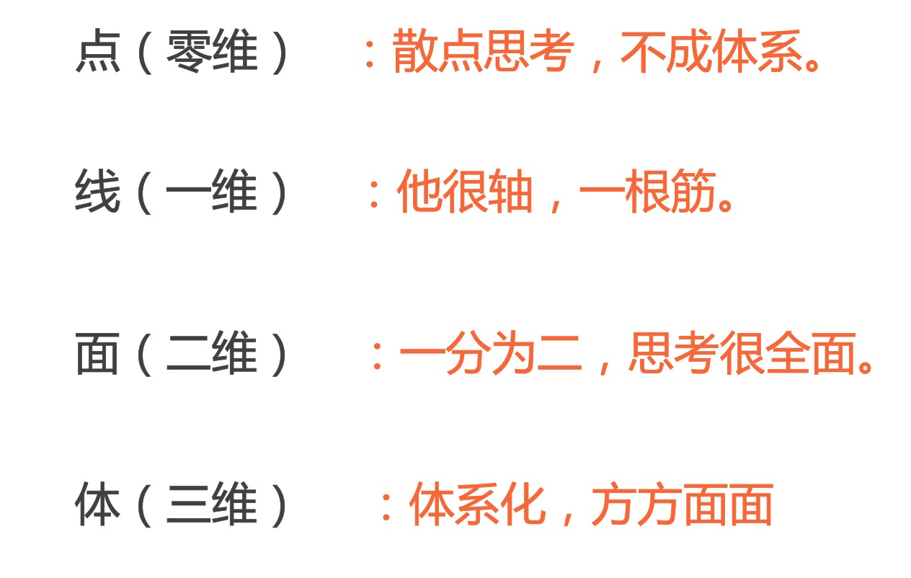

## 无处不在的多维思考

有了这些感悟，我开始系统的整理关于多维度思考分析的资料，发现这种思考方式真是无处不在。发现的越多，我越是感慨，为什么如此重要的思维方式，我到现在才领悟到。

### 波士顿矩阵

比如，在做产品分析的时候，有对产品发展前景进行分析的波士顿矩阵。

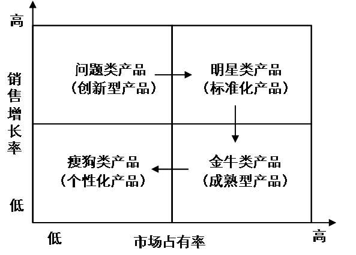

### 订单要素分析

当年，我在1688做交易下单业务的时候，有非常多的下单场景，每种场景下，买家享受的权益是不一样的（如下表所示）。我们当时也是使用了矩阵去表达这个复杂的关系，只是当时还没有想到要将其提升到方法论的高度。

|            | UMP优惠 | 分阶段付款 | 阶梯团 | 信用卡 | 极速到账 | 账期支付 | 信用凭证 | 特定人群 |
| ---------- | ------- | ---------- | ------ | ------ | -------- | -------- | -------- | -------- |
| 普通订单   | Y       | Y          | Y      | Y      | Y        | Y        | Y        |          |
| 伙拼订单   | Y       |            |        | Y      |          | Y        | Y        |          |
| 加工订单   | Y       |            |        | Y      |          |          | Y        |          |
| 采购订单   | Y       | Y          | Y      |        |          |          | Y        |          |
| 自主订单   |         | Y          |        |        | Y        |          |          |          |
| 淘工厂订单 | Y       |            |        | Y      |          |          | Y        |          |
| 一元购订单 | Y       |            |        |        |          |          |          |          |
| 零售通订单 |         |            |        |        | Y        |          |          | Y        |

### 数据交叉分析

在数据分析中，维度分析是非常重要的，特别是维度很多的时候，我们可以通过皮尔逊积矩相关系数，做交叉分析，从而弥补独立维度分析没法发现的一些问题。
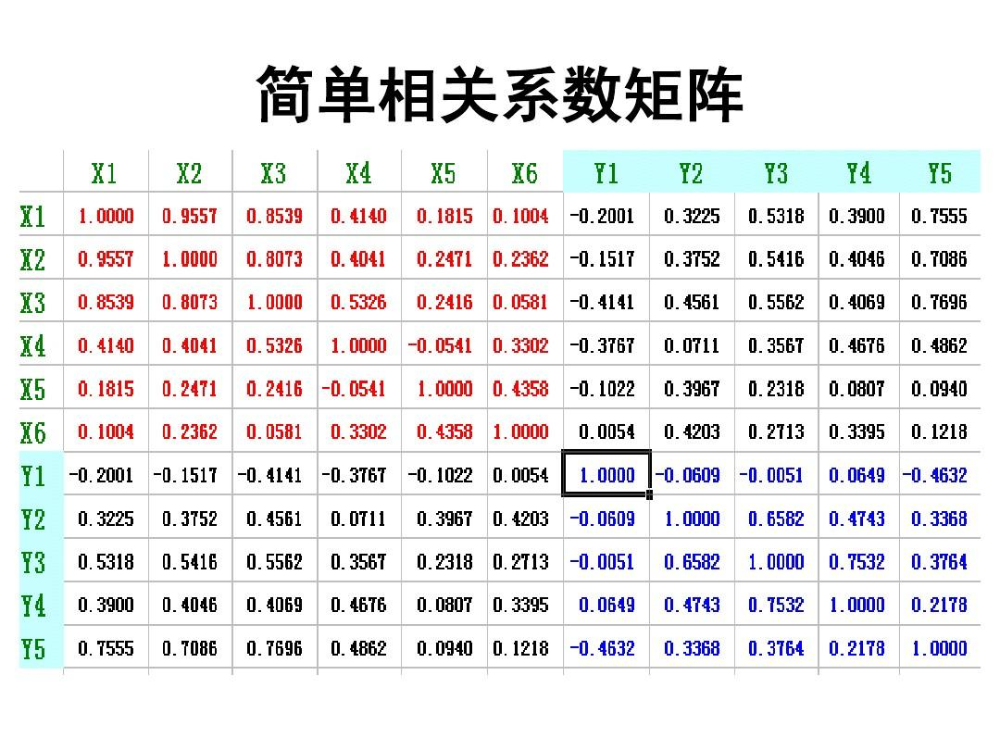

### 分析矩阵

最近我碰巧看到Alan Shalloway写的《设计模式解析：Design Patterns Explained》，这是一本非常经典的关于OOP的书，里面的第十六章就是专门讲“分析矩阵”的，作者创造这个方法论的初衷也是因为业务涉及的要素太多，信息量太大，他需要一种组织海量数据的新方式。
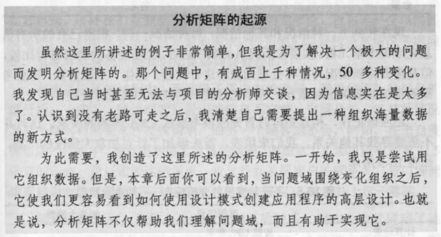

我和Alan的路径不一样，但是都得出了同样的结论。由此可见，**这种矩阵分析的方式的确是对复杂业务进行分析的一把利器，业务场景越多，交叉关系越是复杂，越需要这样的分析**。

### 组织阵型

生产关系决定生产力，对于一个管理者来说，如何有效的设置组织结构是决定团队是否能高效协作的关键。所以我们可以看到公司里面，每年都有比较大的关于组织结构和人员安排的调整。

对于技术团队来说，我们习惯于按领域划分工作范围，这样做的好处是责任到人、职责清晰。然而，领域只是一个维度，我们工作通常都是以项目的形式的开展，而项目通常是贯穿多个领域的。所以，在做团队组织规划的时候，我们可以通过业务领域和业务项目两个维度去看。

比如，在我负责的商品团队，我会按照如下的形式去做职责划分。
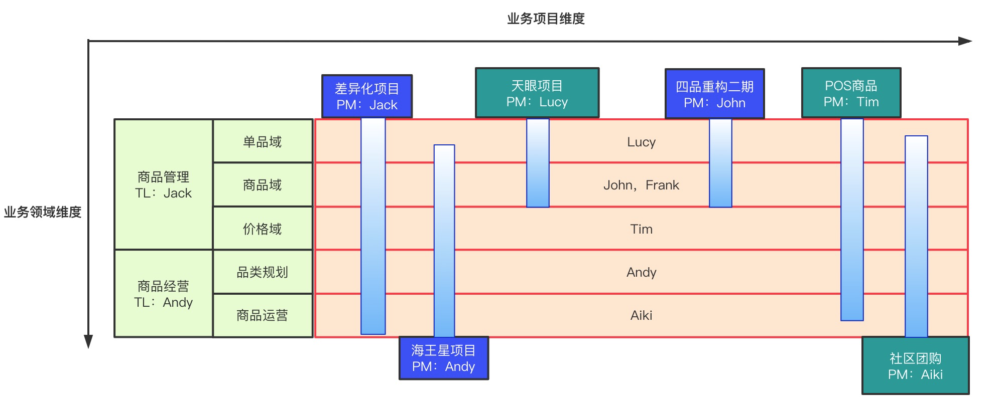

### 时间维度

除了工作，生活中也到处可见多维思考的重要性。

比如，我们说浪费可耻，应该把盘子舔的很干净，岂不知加上时间维度之后，你当前的舔盘，后面可能要耗费更多的资源和精力去减肥，反而会造成更大的浪费。

我们说代码写的丑陋，是因为要“快速”支撑业务，加上时间维度之后，这种临时的妥协，换来的是意想不到的bug，线上故障，以及无止尽的996。

### RFM模型

简单的思考是“点”状的，比如舔盘、代码堆砌就是当下的“点”；好一点的思考是“线”状，加上时间线之后，不难看出“点”是有问题的；再全面一些的思考是“面”（二维）；更体系化的思考是“体”（三维）；比如，RFM模型就是一个很不错的三维模型。可惜的是，在表达上，我们人类只能在二维的空间里去模拟三维，否则四维可能会更加有用。
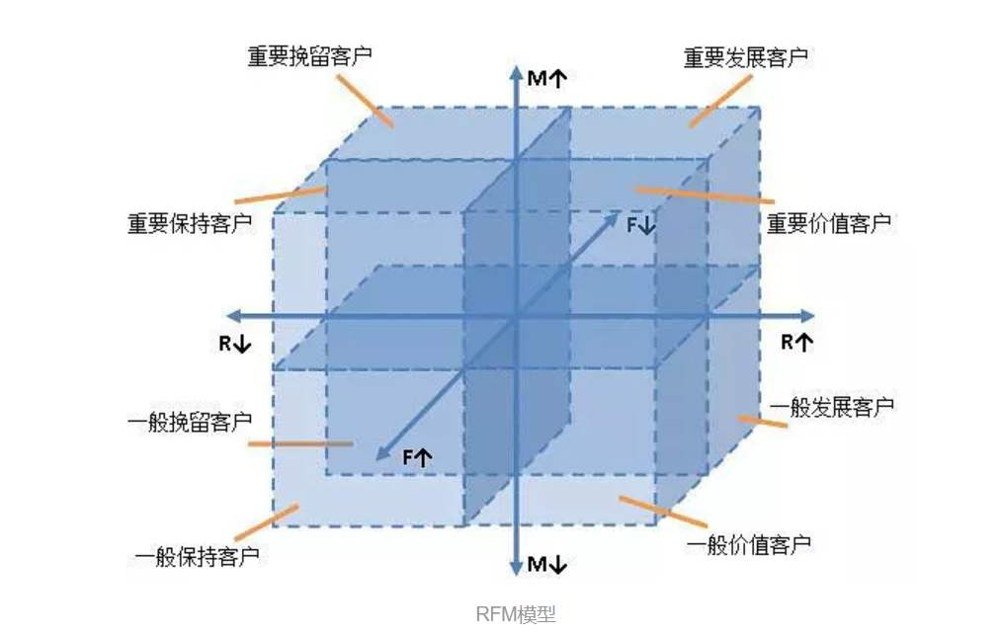

# 复杂业务治理总结

在前言部分，我已经说过了，多维分析是对之前方法论的升级。加上以前的方法论，**完整的方法论应该是“业务理解–>领域建模–>流程分解–>多维分析”**。

为了方便大家理解，下面我把这些方法论做一个简单的串联和解释。

## 业务理解

理解业务是所有工作的起点。首先，我们要找到业务的核心要素，理解核心概念，梳理业务流程。

比如，在零售通的商品域，我们要知道什么是商品（Item），什么是单品（CSPU），什么是组合品（CombineItem）。在下单域，我们要知道订单（order）的构成要素是商品、优惠、支付。在CRM领域，我们要理解客户、机会、联系人、Leads等等。

这里，我想再次强调下语言的重要性，语言是我们思考的载体，就像维特根斯坦说的：“**凡是能够说的事情，都能够说清楚**”

你不应该放过任何一个模糊的业务概念，一定要透彻的理解它，并给与合理的命名（Ubiquitous Language）。唯有如此，我们才能更加清晰的理解业务，才能更好的开展后续的工作。

## 领域建模

在软件设计中，模型是指实体，以及实体之间的联系，这里需要我们具备良好的抽象能力。能够透过庞杂的表象，找到事务的本质核心。

再复杂的业务领域，其核心概念都不应该太复杂，抓住了核心，我们就抓住了主线，业务往往都是围绕着这些核心实体展开的。

比如，商品域虽然很复杂，但其核心的领域模型，无外乎就如下图所示：

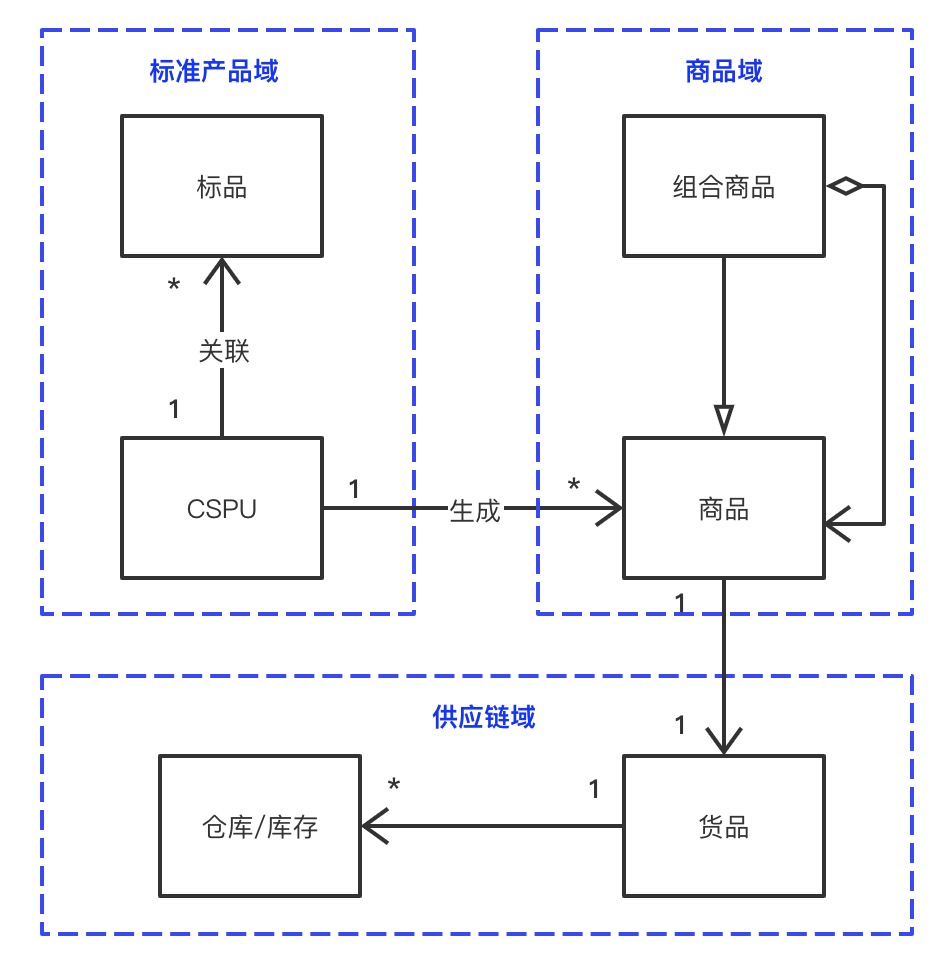

## 流程分解

关于流程分解，在[《一文教会你如何写复杂业务代码》](https://blog.csdn.net/significantfrank/article/details/101095244)里面已经有非常详细的阐述，这里就不赘述了。

简单来说，**流程分解就是对业务过程进行详细的分解，使用结构化的方法论（先演绎、后归纳），最后形成一个金字塔结构**。

比如，在商品领域，有创建商品、商品上架、上架审核、商品下架、下架审核、修改商品、删除商品等一些列动作（流程），每个动作的背后都有非常复杂的业务逻辑。我们需要对这些流程进行详细的梳理，然后按步骤进行分解。最后形成一个如下的金字塔结构：

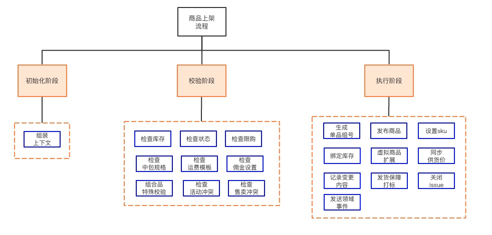

## 多维分析

关于多维分析，我以二维的矩阵分析为例，我想我前面应该已经说清楚了。

业务的复杂性主要体现在流程的复杂性和多维度要素相互关联、依赖关系上，结构化思维可以帮我们梳理流程，而矩阵思维可以帮忙我们梳理、呈现多维度关联、依赖关系。二者结合，可以更加全面的展现复杂业务的全貌。从而让我们的治理可以有的放矢、有章可循。

既然是方法论，在这里，我会尝试给出一个矩阵分析的框架。试想下，如果我们的业务很简单，只有一个业务场景，没有分支流程。我们的系统不会太复杂。之所以复杂，是因为各种业务场景互相叠加、依赖、影响。

因此，**我们在做矩阵分析的时候，纵轴可以选择使用业务场景，横轴是备选维度**，可以是受场景影响的业务流程（如文章中的商品流程矩阵图），也可以是受场景影响的业务属性（如文章中的订单组成要素矩阵图），或者任何其它不同性质的“东西”。

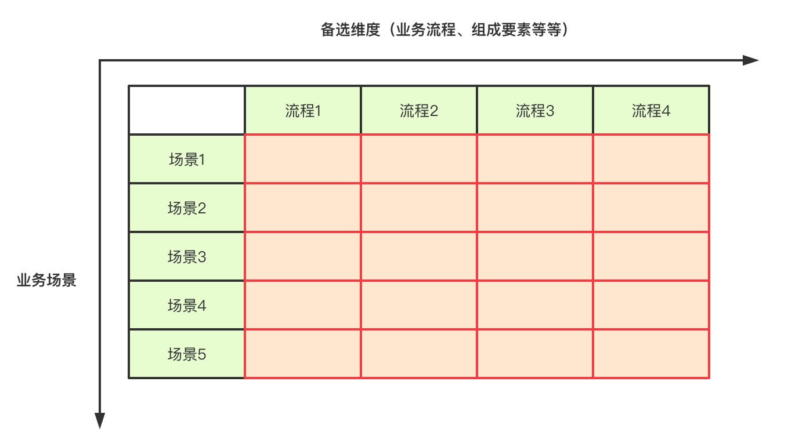

通过矩阵图，可以清晰的展现不同场景下，业务的差异性。基于此，我们可以定制满足差异性的最佳实现策略，可能是多态扩展，可能是分离的代码，也可能是其它。

**这就是矩阵分析的要义，其本质是一种多维度思考的方法论**。

# 篇后寄语

最后，我想说世界是熵增的（即万物都在缓慢的分崩离析），控制复杂度是我们这些从业者无法推卸的责任和使命。

软件行业的发展才几十年，还是一门年轻的学科，**软件工程就像一个刚学会走路的小孩，还很不成熟，有时还很幼稚**。

但毕竟还是有几十年的沉淀，还是有一些好的方法和实践可以参考，我的这些总结沉淀只是在前人的基础上，多走了一点点而已。但就是这一点点，也实属来自不易，其中冷暖，只有自己能体会。可以说，这一路走来，是一场对心力、脑力和体力的持续考验。

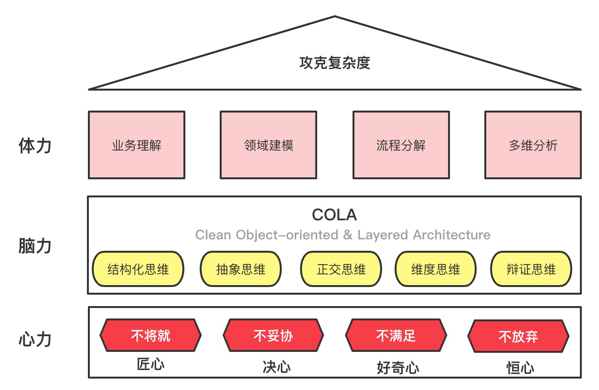

- 心力是指不将就的匠心，不妥协的决心，不满足的好奇心、以及不放弃的恒心。
- 脑力是指那些必要的思维能力、学习能力、思考能力、思辨能力。
- 之所以说“业务理解–>领域建模–>流程分解–>多维分析”是体力，**是因为实现它们就像是在做填空题，只要你愿意花时间，再复杂的业务都可以按部就班的清晰起来**。

梳理清晰了，再配合[COLA](https://github.com/alibaba/COLA)（[https://start.aliyun.com/](https://start.aliyun.com/bootstrap.html)）的指导，我们就有可能写出清晰、易读的代码，就有可能从一个if-else coder升级为一个complexity conquer。

而这不正是我们工程师孜孜不倦的追求吗?