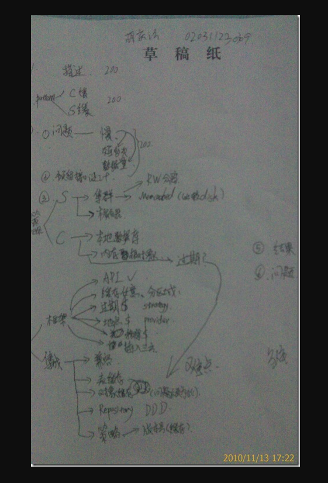

如何写论文

用10分钟在草稿纸上写出思维导图， 例如下面是分布式缓存系统设计的导图。

如何提高系统架构师写作水平：

http://www.cnblogs.com/muhongxing/archive/2010/10/10/1847476.html

素材

敏捷（scrum，XP），MVC，插件结构（OSGI），云（PaaS, IaaS, SaaS），SOA（Restful）

论文构思

- 使用思维导图

- 仔细阅读题目

- 头脑风暴，将能想到的素材写作草稿纸的右方（好的关键词，或句子）

- 拟定总论点 （在纸的左边使用思维导图）
  可以从以下角度进行思考：
  软件的开发流程（需求分析，系统设计，详细设计，编码 + 单元测试，测试（功能测试，集成测试，回归测试，性能测试，验收测试），部署） 整个过程迭代。
  软件的架构风格 （MVC，分层，事件驱动）
  软件的质量属性（性能，可靠性，可用性，安全性，可修改性，互操作性）
- 拟定分论点，回答试题中的提到的问题

- 划分章节

- 大体估计字数

摘要撰写

- 摘要应控制在300~400字的范围内。

- 摘要八股文

（1）本文讨论......系统项目的.........（论文主题）。该系统.........(项目背景、简单功能介绍）。在本文中首先讨论了...........(技术、方法、工具、措施)，最后............(不足之处、如何改进、特色之处、发展趋势）。

在本项目的开发过程中，我担任了..........

正文撰写

- 字数在2000~3000之间

- 论文结构

过程	字数
项目概述
* 开发项目概述
* 我承担的角色和工作
* 项目的架构情况概述	400~600字
采用的手段
* 面临的问题
* 解决方案和策略	1000 ~ 1400
实施的效果	200 ~ 300
不足之处和改进方案	200 ~ 300
总结	100 ~ 200
公司系统概述：

在全球有97Million的活跃用户，Web表现层平均每天会收到20亿次的浏览请求，监控系统每天分析的日志在TB级，有200多个SOA服务堆栈，每天被调用10亿次，系统存储的数据在PB级。支付系统每天接受用户请求在10M以上，访问数据库在100M以上。构建的系统需要保证数10亿交易的99.999%的可用性。公司是采用基于Java和J2EE技术的Web架构，Web服务器选用的是WAS CE（WebSphere Application Server Community Edition 一个基于Apache Geronimo的轻量级JEE 容器），数据库是Oracle 11g。 16,000应用服务器，220个应用集群（Pool）

MMP项目，在MMP之前只有EMS，后面被拆分为OPMS，EL，PGW。

公司的基础架构件（中间件）有CAL, DAL, BES。

监控很重要，是系统运维，故障定位，性能分析的基础。

论分布式数据库设计：

数据拆分，数据访问层设计，分布式事务管理（CAP（Consistency, Availability, Partition Tolerance)，BASE(Basically Available, Soft Sate, Eventually Consistency).

分布式系统设计：

分布式应用的优点：

1. 性能和可伸缩性

2. 高可用性

3. 可以并行开发

4. 分离关注点

论基于构件的开发（Component-Based Software Development)：

基于构件的组装，可以更快地构造系统，提高系统可维护性，减轻系统维护负担，降低软件开发费用。

需求分析，系统建模往往是自上而下的方式，开发构件是自下而上的。

构件可以是商用成品构件COTS（Commercial-Off-the-Shelf)，也可以是OpenSource的，也可以是自行开发的。

CBSD真个过程是，用传统需求获取技术建立系统的需求规约（Requirement Specification），在完成体系结构设计后，并不立即开始详细设计，而是确定哪些部分可有构件组装完成。

构件鉴定：也就是去发现构件，难度较大，在内部发现，在外部发现。

构件适配：如果被复用的构件不符合目标系统的架构，就可能导致构件无法正常工作，甚至影响整个系统的运行，这种情况称为失配（Mismatch)。 调整构件使之满足体系结构要求的行为就是构件适配。构件适配可通过白盒、灰盒和黑盒的方式。

构件更新：基于构件的系统演化往往表现为构件的替换或增加。

购买的构件（Oracle 数据库）对 JDBC driver 的灰黑扩展，使其具有connection pool.

开源的构件 （Junit，Jaxb，apache utility).

自己开发的构件（kernal，CAL，DAL）

构件和中间件类似，都是可以复用的组件。由于中间件的出现，软件开发可以变得十分专业，例如通信中间件，消息中间件，数据库中间件，他们屏蔽了许多繁琐的细节，使得应用程序开发人员可以专注于质量和业务逻辑优化，各种不同的劳动得以在自己熟悉的领域得到发展，不用分散精力，这就是分工带来的优势，专业化带来的好处，如今，在计算机软件科学中，这就是基于构件开发（中间件）带来的好处。

论基于服务的软件体系结构SOA:

SOA 的作用：

1. 解决信息孤岛

2. 实现功能重用

3. 可以并行开发

SOA的设计原则：

1. 无状态性

2. 功能单一性

3. 明确定义的接口

4. 松耦合性

5. 粗粒度

6. 功能重用，互操作性

SOA的主要实现方式：webservice， REST

消息格式： NVP（Name Value Pair), JSON, XML, SOAP 

论企业应用集成：

自己开发的消息中间件BES（Business Event System)，使用消息处理方式，有诸多好处，1. 异步调用，减少响应延迟，任何可以晚点再做的事情都应该晚做，如活动跟踪，决算，日志和报表等。

2. 调用者 和 被调用者之间彻底的解耦。增强系统的可修改性

3. 增强系统的可用性，同步调用中，组件A调用组件B，如果组件B不可用，那么组件A也不可用，异步调用中A和B的可用性是独立的。

4. 消峰，同步调用迫使你用负载的峰值来配置基础设施，异步可以缓解峰值压力。

为什么不使用已有的产品例如IBM的MQ呢？公司的业务流量非常庞大，而且数据是高度分布式的，如果使用集中式的MQ产品，势必会给消息服务器带来巨大的压力，会影响消息处理性能，这种以数据库为核心的轻量级消息中间件实现方式，真好利用了现有的分布式数据库的优势，将消息处理压力分摊到各应用自己所使用的数据库上，提供了更好的性能和可扩展性。例如，支付应用的消息由支付应用程序产生，并存储在支付数据库中，而其它应用所产生的消息也分别在各自的数据库中。其缺点是，这种实现方式高度依赖公司内部的数据库，不具备可移植性，以及和外部企业的互操作性。这也真是作为架构所要做的权衡，鉴于公司更换数据库的可能性不大，和企业外部通信业基本不会用MQ的方式，所以最后还是选择了用自己开发的轻量级、分布式的消息中间件。

论基于**体系结构的软件开发。ABSD ( Achitecture Based Software Design)

体系结构设计6个过程：

架构需求 （1.满足业务上的功能性需求； 2. 同时，还要获得软件质量属性，满足一些非功能需求）

架构设计（选择合适的架构风格很重要。架构设计是一个迭代的过程。）

架构文档化（文档要从使用者的角度进行编写，主要输出结果是体系结构规格说明书和测试体系结构需求的质量说明书）

架构复审（每次迭代要安排一次由外部人员（用户代表和领域专家）参加的复审，搭建一个可运行的最小化系统用于评估和测试架构是否满足要求）

架构实现

架构演化。

论软件安全性设计：

Https 对 login 和 敏感信息进行安全保障。公钥，私钥。

session管理：

sessionId被保存在cookie中，如何防止用户伪造sessionId，用HMAC-SHA1对其进行加密/解密，密钥是periodical的

SOA Security：

使用SSL确保通信安全。

需要API userName， Password（知道什么）。

（拥有什么）：

Signature（签名）
File-based Certificate（文件证书）
Steps:
1. 通过userName, password, signature获得本次访问的token
2. 后面的每次调用service都必须加上token的信息，token的有效期是半小时（现在 - 用户最后一次活动时间）

